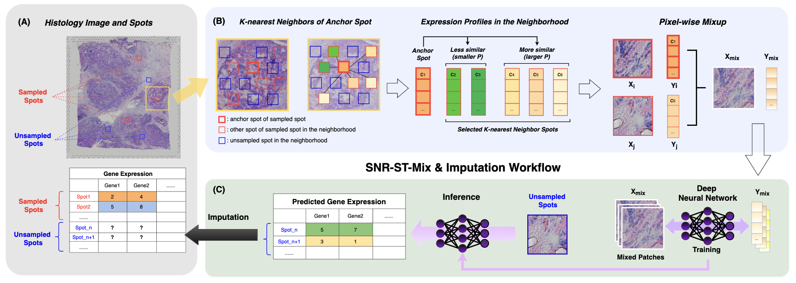

# SNR-ST-Mix

**Sample-specific Neighborhood Regression Mixup for Augmented Spatial Transcriptomics Imputation with Deep Neural Network**

[](https://arxiv.org/abs/2606.08712)

Official PyTorch implementation of **SNR-ST-Mix**, a neighborhood- and
expression-aware mixup framework for predicting spatial gene expression from
histology.

**Hongyi Yu, Yaoyu Fang, Jiahe Qian, Xinkun Wang, Lee A. Cooper, and Bo Zhou**

[[Paper](https://arxiv.org/abs/2606.08712)]
[[Data](https://huggingface.co/datasets/MahmoodLab/hest)]
[[Installation](#installation)]
[[Training](#training)]
[[Citation](#citation)]

<p align="center">
  
</p>

## Overview

Spatial transcriptomics provides spatially resolved gene-expression
measurements, but the available spot-level training data can be limited and
noisy. SNR-ST-Mix augments histology-expression pairs by mixing each anchor
with a nearby, biologically related training spot. The method is designed to:

- constrain interpolation to a local neighborhood;
- favor partners with similar expression profiles;
- train without changing the prediction backbone; and
- improve imputation accuracy and stability across tissue types.

The training objective combines vicinal regression, mixup consistency,
edge-preservation, and Pearson-correlation terms. See the
[paper](https://arxiv.org/abs/2606.08712) for the complete method and
experimental analysis.


## Repository structure

```text
SNR-ST-Mix/
├── assets/                  # Framework and result figures
├── configs/
│   └── default.yaml         # Canonical training configuration
├── experiments/
│   ├── ablation/            # Mixup and neighborhood ablations
│   ├── backbones/           # Img2ST-Net- and MagNet-inspired experiments
│   └── legacy/              # Preserved original training implementation
├── scripts/
│   └── train.py             # Configuration-driven training entry point
├── src/snr_st_mix/
│   ├── augmentation.py      # Datasets and SNR-ST-Mix sampling
│   ├── config.py            # YAML loading and CLI overrides
│   ├── data.py              # HEST loading, alignment, and splitting
│   ├── metrics.py           # Pearson loss and evaluation PCC
│   ├── models.py            # Histology-to-expression predictor
│   ├── trainer.py           # Training, evaluation, and checkpointing
│   └── utils.py             # Seeding and logging
├── visualization/           # Analysis and visualization notebooks
└── pyproject.toml           # Package metadata and dependencies
```

## Installation

```bash
git clone https://github.com/Advanced-AI-in-Medicine-and-Physics-Lab/SNR-ST-Mix.git
cd SNR-ST-Mix

conda create -n snr-st-mix python=3.11 -y
conda activate snr-st-mix

python -m pip install --upgrade pip
python -m pip install -e .
```

## Data
The experiments use samples from
[HEST-1k](https://huggingface.co/datasets/MahmoodLab/hest). Access to the HEST
files requires accepting the dataset terms on Hugging Face.


## Training

Example: run a one-epoch test:

```bash
python scripts/train.py \
  --config configs/tenx13_local.yaml \
  training.epochs=1 \
  training.num_workers=0
```

The run uses a seeded random 30%/20%/50% train/validation/test split by
default. The checkpoint with the lowest validation MSE is selected for final
test evaluation.


## Citation

If you use this repository, please cite:

```bibtex
@misc{yu2026snrstmix,
  title         = {SNR-ST-Mix: Sample-specific Neighborhood Regression Mixup for
                   Augmented Spatial Transcriptomics Imputation with Deep Neural Network},
  author        = {Yu, Hongyi and Fang, Yaoyu and Qian, Jiahe and Wang, Xinkun and
                   Cooper, Lee A. and Zhou, Bo},
  year          = {2026},
  eprint        = {2606.08712},
  archivePrefix = {arXiv},
  primaryClass  = {cs.LG},
  doi           = {10.48550/arXiv.2606.08712},
  url           = {https://arxiv.org/abs/2606.08712}
}
```

